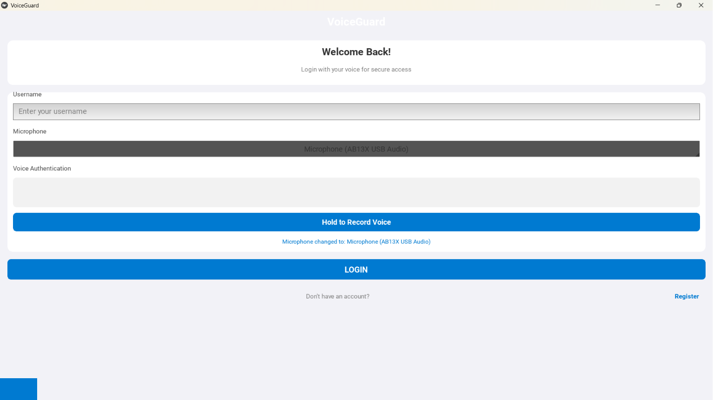
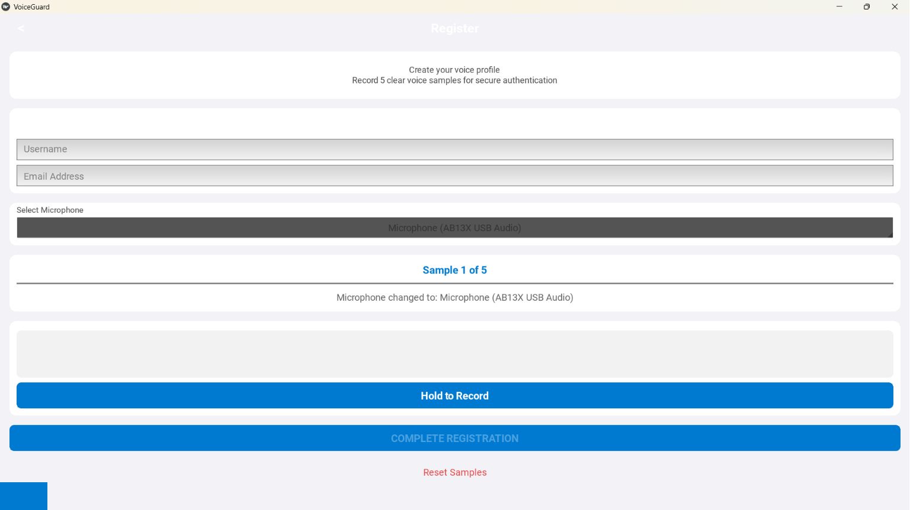
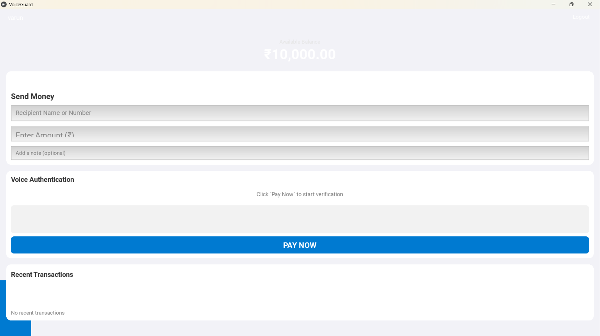
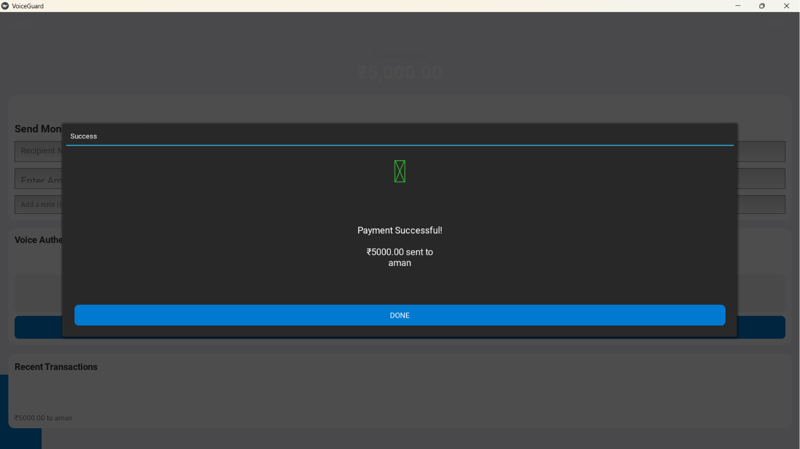
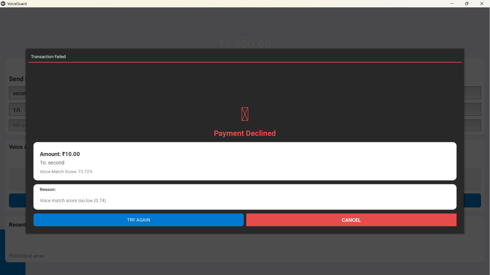

# 🔐 VoiceGuard

<div align="center">

### Advanced Voice Biometric Authentication System for Faster Logins & Secure Digital Transactions

VoiceGuard is an AI-powered desktop application that replaces traditional passwords and OTPs with secure **voice biometric authentication**. It combines modern machine learning, digital signal processing, anti-spoofing techniques, and encrypted biometric storage to provide a secure and seamless authentication experience.


</div>

---

# 📸 Screenshots

## 🔑 Login Screen



Secure voice login with microphone selection and voice authentication.

---

## 📝 User Registration



Create a secure voice profile by recording five voice samples.

---

## 💳 Payment Dashboard



Voice-authenticated payment interface with transaction history.

---

## ✅ Successful Authentication & Payment



Secure payment completed after successful voice verification.

---

## ❌ Authentication Failed



VoiceGuard blocks transactions when the voice match score falls below the authentication threshold.

---

# 🏗 System Architecture

> *(Insert your architecture diagram from the research paper here.)*

```
                User
                  │
                  ▼
          Voice Recording
                  │
                  ▼
         Audio Preprocessing
                  │
                  ▼
      Feature Extraction Layer
       (MFCC • Mel Spectrogram
       Pitch • Energy • Formants)
                  │
                  ▼
        Deep Learning Embedding
                  │
                  ▼
      Anti-Spoofing & Replay Detection
                  │
                  ▼
        Similarity Score Engine
                  │
                  ▼
       Authentication Decision
                  │
                  ▼
      Encrypted Biometric Database
```

---

# ✨ Features

- 🎤 Voice Biometric Authentication
- 🔒 Encrypted Voice Template Storage
- 🧠 Deep Learning Voice Embeddings
- 📊 MFCC & Mel Spectrogram Feature Extraction
- 🛡 Replay Attack Detection
- 🎯 Voice Match Scoring
- 🔑 Challenge-Based Authentication
- 🔐 Secure Transaction Verification
- 💳 Voice Protected Payments
- 🎙 Multiple Microphone Support
- 📈 Audio Quality Analysis
- 🖥 Modern Desktop Interface

---

# 🧠 How It Works

```
User Speaks
      │
      ▼
Audio Recording
      │
      ▼
Noise Reduction
      │
      ▼
Voice Activity Detection
      │
      ▼
MFCC Extraction
      │
      ▼
Mel Spectrogram
      │
      ▼
Deep Learning Embedding
      │
      ▼
Replay Detection
      │
      ▼
Similarity Calculation
      │
      ▼
Authentication
      │
      ▼
Secure Payment
```

---

# 🔒 Security Features

### 🔹 Voice Biometrics

Uses unique vocal characteristics for authentication instead of passwords.

---

### 🔹 Replay Attack Detection

VoiceGuard compares incoming voice samples against historical recordings to identify replay attacks using cosine similarity and behavioral analysis.

---

### 🔹 Encrypted Storage

Voice templates are encrypted before storage using modern cryptographic techniques.

---

### 🔹 Voice Quality Verification

The application evaluates:

- Signal-to-Noise Ratio (SNR)
- Silence Ratio
- Audio Duration
- Clipping Detection

Poor quality audio is automatically rejected.

---

### 🔹 Deep Learning Verification

Voice authentication is performed using neural embeddings generated from multiple acoustic features rather than simple waveform comparison.

---

# 🧠 Machine Learning Features

VoiceGuard extracts numerous voice characteristics including:

- Mel Frequency Cepstral Coefficients (MFCC)
- Delta MFCC
- Mel Spectrogram
- Spectral Centroid
- Spectral Rolloff
- Zero Crossing Rate
- Pitch
- Energy
- Formant Frequencies

These features are used to generate speaker embeddings for authentication.

---

# 🛠 Technologies Used

## Programming

- Python

## GUI

- Kivy

## Machine Learning

- PyTorch
- Scikit-Learn

## Audio Processing

- Librosa
- SciPy
- NumPy
- SoundDevice
- SoundFile

## Security

- Cryptography (Fernet)
- PBKDF2
- PyOTP

---

# 📂 Project Structure

```text
VoiceGuard
│
├── assets/
├── screenshots/
├── models/
├── recordings/
├── database/
├── main.py
├── requirements.txt
└── README.md
```

---

# 🚀 Installation

Clone the repository

```bash
git clone https://github.com/VarunParmar0206/VoiceGuard.git
```

Move into the project

```bash
cd VoiceGuard
```

Install dependencies

```bash
pip install -r requirements.txt
```

Run the application

```bash
python main.py
```

---

# 📈 Performance

| Version | Accuracy | Liveness |
|----------|----------:|----------:|
| V1 | 86.0% | 78% |
| V2 | 88.5% | 82% |
| V3 | 90.2% | 86% |
| Latest | **94.6%** | **94%** |

> *(You can place the performance comparison graph from your research paper below this table.)*

---

# 📖 Research

This project is based on our research work:

**VoiceGuard – A Voice Biometric System for Faster Logins and Secure Digital Transactions**

The research focuses on building a secure authentication framework using:

- Voice Biometrics
- Deep Learning
- Anti-Spoofing
- Replay Attack Detection
- Secure Biometric Storage
- Digital Transaction Security

---

# 🔮 Future Improvements

- Transformer-based Speaker Verification
- Wav2Vec2 Integration
- Mobile Application
- Cloud Synchronization
- Edge AI Deployment
- Continuous Authentication
- Multilingual Voice Models
- Blockchain Identity Integration

---

# 👨‍💻 Author

## Varun Parmar

**B.Tech Computer Science & Engineering**

Greater Noida Institute of Technology (GNIOT)

📧 **Email:** varunparmar602@gmail.com

💼 **LinkedIn:**  
https://www.linkedin.com/in/varun-parmar-287690390

💻 **GitHub:**  
https://github.com/VarunParmar0206

---

# ⭐ Support

If you found this project interesting, consider giving it a ⭐ on GitHub.

It helps others discover the project and supports future development.

---

# 📄 License

This project is licensed under the **MIT License**.
